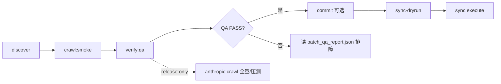

# AGENTS.md

面向 AI Agent 的本仓库工作指南。**开始任何任务前先读本文**，再按需查阅链接文档。

## 阅读顺序

| 顺序 | 文档 | 何时读 |
|------|------|--------|
| 1 | 本文 `AGENTS.md` | 每次会话开始 |
| 2 | `ARCHITECTURE.md` | 改脚本、理解流水线、定位产物 |
| 3 | `DEBUG.md` | 报错、QA FAIL、鉴权失败 |
| 4 | `EXPERIENCE.md` | 踩坑记录、历史决策、已知限制 |
| 5 | `docs/FEISHU_CLI_INTEGRATION.md` | 飞书 CLI 接入细节 |
| 6 | `README.md` | 面向人类的快速开始与命令表 |

## 仓库目标

`agent-docs` 是**多厂商 AI/Agent 技术资料库**的基础设施仓库。准确架构范式是 **Agent Skills + Workflow 驱动的知识生产系统**：Agent/Workflow 负责阶段推进、判断、审校、例外处理；代码负责确定性的 tools、QA、hooks、CLI 封装与自动化测试。

当前阶段（Stage 1）重点是**开发资料源材料的高质量收集与完善**：

1. **Source Library 主线**（本阶段实现 Anthropic）：抓取官方技术文档/文章 → 中文优先 → 图片/结构保真 → 技术 QA + 内容 QA → 产出可追溯 artifacts。
2. **确定性工具层**：格式处理、图片处理、接口/命令行封装、QA、hooks、自动化测试等。
3. **Feishu CLI 接入与同步支线**：安装、鉴权、健康检查、dry-run/execute；同步发生在资料收集完善后，不是 Stage 1 主线成功标准。

后续阶段再规划跨厂商 taxonomy、学习路径、深度分析、商品化包装与发布前商业策略。

规划中的厂商资料库（飞书与本地 artifacts 均预留同级目录）：

| 厂商库 | 飞书根 | 状态 |
|--------|--------|------|
| Anthropic | `anthropic-docs/` | **active**（`agent_docs/cli/` + `scripts/anthropic_content_pipeline.py` 兼容入口） |
| OpenAI | `openai-docs/` | reserved |
| Gemini | `gemini-docs/` | reserved |
| Cursor | `cursor-docs/` | reserved |

代码侧注册表：`VENDOR_LIBRARIES`（`agent_docs/vendors/registry.py`）。

人类用户看 `README.md`；Agent 以本文 + `ARCHITECTURE.md` 为权威上下文。

## 目录地图

```
agent-docs/
├── AGENTS.md              # Agent 入口（本文）
├── ARCHITECTURE.md        # 系统结构与数据流
├── DEBUG.md               # 排障手册
├── EXPERIENCE.md          # 经验沉淀（可追加）
├── README.md              # 人类快速开始
├── package.json           # npm 脚本入口
├── workflows/
│   └── stage1_source_library.md        # Stage 1 控制流程
├── skills/                             # Stage 1 Agent Skills（source-discovery 等）
├── agent_docs/                         # 确定性 Python 工具包（ingest/qa/sinks/cli）
│   └── cli/                            # Stage 1 pipeline 编排
├── scripts/
│   ├── anthropic_content_pipeline.py   # 兼容入口 wrapper
│   ├── verify_matrix_urls.txt          # verify:qa 代表性 URL 矩阵
│   ├── run_anthropic_verify_qa.sh      # verify:qa npm 脚本入口
│   ├── setup-feishu-cli.sh
│   ├── check-feishu-cli.sh
│   ├── check-feishu-cli-auth.sh
│   └── auth-feishu-cli.sh
├── docs/
│   └── FEISHU_CLI_INTEGRATION.md
├── artifacts/             # 流水线产物（未默认 gitignore；--commit 时可入库）
└── .github/workflows/     # CI：脚本与文档可用性检查
```

## 任务路由

| 用户意图 | 优先动作 | 关键命令 |
|----------|----------|----------|
| Stage 1 资料收集完善 | 读 `workflows/stage1_source_library.md` + `ARCHITECTURE.md` | discover → smoke → verify:qa |
| 改代码前 / 完工后 | 跑测试 + lint + smoke | `pip install -e ".[dev]" && npm run lint:py && npm run test:py`；改 ingest/fetch 后再跑 `npm run anthropic:crawl:smoke` |
| 安装/检查飞书 CLI | 读 `docs/FEISHU_CLI_INTEGRATION.md` §4.1 | `npm run feishu:check:full` |
| 飞书登录失败 | 读 `DEBUG.md` → 飞书鉴权（非账号类型问题） | `npm run feishu:auth:device:proxyless` |
| 验证抓取流程 | smoke，不跑 QA/翻译 | `npm run anthropic:crawl:smoke` |
| ingest/QA 回归验证 | 代表性 URL 矩阵 + QA | `npm run anthropic:verify:qa` |
| 全量生产交付 / 手动压测 | discover → smoke → verify:qa → crawl | `npm run anthropic:crawl`（**非**日常 E2E） |
| QA 失败 | 读 `batch_qa_report.json` + `DEBUG.md` | 检查 `artifacts/.../batch-*/` |
| 同步到飞书 | 必须 QA PASS（除非用户明确 `--force-sync`） | `npm run anthropic:sync-dryrun` 先于 execute |
| 改流水线逻辑 | 读 `ARCHITECTURE.md`，改 `agent_docs/` 对应模块 | smoke 验证 |

## 推荐工作流（Anthropic 流水线）



标准顺序（日常 / post-ingest）：

1. `npm run anthropic:discover` — 确认 URL 范围
2. `npm run anthropic:crawl:smoke` — 5 条、无 QA、无翻译
3. `npm run anthropic:verify:qa` — 代表性矩阵（~6 URL）、QA 开启 → `artifacts/anthropic-content-verify`
4. 检查 `artifacts/anthropic-content-verify/batch-*/batch_qa_report.json`
5. QA 通过后：`npm run anthropic:commit`（仅用户明确要求时；针对生产 output root）
6. `npm run anthropic:sync-dryrun` → 用户确认 → `npm run anthropic:sync`

**`npm run anthropic:crawl`（全量）**：仅用于生产交付或发布前手动容量/压力测试，**不是**日常 smoke/QA 路径。跑全量前应先 `verify:qa` PASS。

## 环境变量

| 变量 | 用途 | 必需场景 |
|------|------|----------|
| `LANGCRAFT_CMD` | 外部翻译 CLI | 可选，优先于 OpenAI |
| `OPENAI_API_KEY` | OpenAI 翻译 | 未设 `LANGCRAFT_CMD` 且需翻译时 |
| `FEISHU_DOC_FOLDER_TOKEN` | 飞书文档目录 | `--execute-feishu` 实际上传 |
| `LARK_CLI_NO_PROXY=1` | 鉴权不走代理 | 代理导致飞书登录失败时 |

完整说明见 `README.md` 与 `ARCHITECTURE.md`。

## 翻译与术语（涉及 `--translate` 时）

- **默认路径**：优先配置 `LANGCRAFT_CMD`，走 LangCraft skills 做翻译与审校；未配置时再 fallback 到 `OPENAI_API_KEY`。
- **术语保留**：以下英文术语默认保留原文，不强行中文化：`Agent`、`Skill`、`Token`、`MCP`、`CLI`、`API`、`OAuth`、`JSON`、`Markdown`、`YAML`、`SDK` 等。
- **结构保留**：标题、列表、代码块、表格、链接、图片占位符必须完整保留。
- **示例**：
  ```bash
  export LANGCRAFT_CMD='node path/to/langcraft-cli --translate --from en --to zh --markdown'
  ```

## Agent 行为约束

### 必须遵守

- **不提交密钥**：`.env`、App Secret、Token 不得写入仓库；见 `.gitignore`。
- **不擅自 git commit/push**：仅用户明确要求时执行；遵守用户 git 安全规则。
- **QA 门禁**：默认 `--force-sync` / `--force-commit` / `--allow-failures` 需用户明确授权。
- **先 smoke 再大跑**：改流水线后至少跑 `anthropic:crawl:smoke`。
- **飞书鉴权需人工**：浏览器授权不可由 Agent 代替；用 `--no-wait` 生成链接交给用户。
- **验证后再声称完成**：改脚本后运行相关 `npm run` 检查；见 `DEBUG.md` 验证清单。

### 代码风格（本仓库）

- Bash：`set -euo pipefail`，错误信息带 `[ERROR]`/`[OK]`/`[WARN]` 前缀。
- Python：单文件流水线，`argparse` 入口；保持与现有函数命名一致。
- 文档：Agent 文档用中文；代码、命令、路径、JSON 字段保持英文原文。
- 改动范围：最小 diff，不重构无关逻辑。

### 产物与 git

- 默认输出根：`artifacts/anthropic-content`
- 已有 `batch-*` 目录时，全量 crawl 会失败，需 `--resume-output` 才能续跑
- `--commit` 会 `git add` 整个 batch 目录；不要对含 secrets 的路径 commit

## npm 脚本速查

| 脚本 | 作用 |
|------|------|
| `test:py` / `lint:py` | Python 单测 / ruff lint |
| `feishu:install` / `feishu:setup` | 安装 CLI |
| `feishu:config` | 交互式应用配置 |
| `feishu:auth` / `feishu:auth:device:proxyless` | 登录 |
| `feishu:check` / `feishu:check:auth` / `feishu:check:full` | 环境与鉴权检查 |
| `anthropic:discover` | 仅生成 URL 清单 |
| `anthropic:crawl:smoke` | 小规模验证（无 QA） |
| `anthropic:verify:qa` | 代表性 URL 矩阵 + QA（日常/post-ingest） |
| `anthropic:crawl` | **生产全量 / 手动压测**（非日常 E2E） |
| `anthropic:commit` | QA 通过后 git commit batch |
| `anthropic:sync-dryrun` / `anthropic:sync` | 飞书同步（dry-run / 执行） |

## CI 边界

- `.github/workflows/python-ci.yml`：`ruff` + `pytest` + `py_compile` + `--self-test-feishu-paths`（Python 3.10 / 3.12）。
- `.github/workflows/feishu-cli-smoke.yml`：仅 `npm run feishu:check`（不要求飞书登录态）。不要在 CI 假设本地已有 `lark-cli` 授权。
- **`anthropic:verify:qa` 不在 CI 中跑网络 crawl**（依赖外网与耗时）；改 ingest/QA 后在本地执行。

## 飞书接入验证

```bash
npm run feishu:check:full    # 文件 + CLI + auth_level
lark-cli auth list           # 文档同步前应有 logged-in user
npm run feishu:doctor        # 网络/配置；token_exists 失败表示需 user 登录
```

**auth_level**：`bot` = 应用已配置；`user` = 用户 OAuth 完成。个人账号与企业账号均可达到 `user`。详见 `docs/FEISHU_CLI_INTEGRATION.md` §4.1。

## 飞书目录规范（多厂商资料库）

**关键：`FEISHU_DOC_FOLDER_TOKEN` 必须指向名为 `agent-docs` 的文件夹**（默认 `FEISHU_DOC_ROOT_MODE=agent-docs-folder`）。勿用 `agent-docs-e2e-real` 等临时名作为生产根目录。

`feishu_sync_report.json` 的 `folder_path` 与 E2E 清单使用**从云盘根起的完整路径**（含 `agent-docs/` 前缀）；`lark-cli` 建目录时 token 已在 `agent-docs/` 内，故 `folder_segments` 不含该前缀。

Anthropic 子树由 `feishu_folder_segments(source_url, cfg)` 按 **来源 URL** 生成：

```text
agent-docs/                          ← FEISHU_DOC_FOLDER_TOKEN（文件夹名必须是 agent-docs）
  anthropic-docs/                    ← 本阶段 active
    Anthropic/
      Anthropic Academy/           ← anthropic.com/learn
      Claude/
        Blog/                      ← claude.com/blog
      Engineering/                 ← anthropic.com/engineering
      Developer-docs/              ← platform.claude.com/docs
        agents-and-tools/
          agent-skills/
            {文档标题}              ← 无 -import 后缀
      Tutorials/                   ← claude.com/resources/tutorials
      User Cases/                  ← claude.com/resources/use-cases
  openai-docs/                     ← 预留
  gemini-docs/                     ← 预留
  cursor-docs/                     ← 预留
```

环境变量：

| 变量 | 默认 | 说明 |
|------|------|------|
| `FEISHU_DOC_FOLDER_TOKEN` | — | **`agent-docs` 文件夹** token |
| `FEISHU_DOC_ROOT_MODE` | `agent-docs-folder` | `parent` 时 token 为 agent-docs 的父目录 |

本阶段 **不同步** `claude.com/resources/courses`（视频为主）。正文视频链保留原始 URL，不下载嵌入。

Codex 接手任务：见 [docs/CODEX_GOAL.md](./docs/CODEX_GOAL.md)。

## 经验与排障

- 新问题解法写入 `EXPERIENCE.md`（带日期与上下文）。
- 可复现排障步骤写入 `DEBUG.md`。
- 架构变更同步更新 `ARCHITECTURE.md`。

## 相关文档索引

- [ARCHITECTURE.md](./ARCHITECTURE.md) — 组件、数据流、QA 规则、产物 schema
- [DEBUG.md](./DEBUG.md) — 分场景排障与验证清单
- [EXPERIENCE.md](./EXPERIENCE.md) — 历史经验与决策记录
- [docs/CODEX_GOAL.md](./docs/CODEX_GOAL.md) — Codex `/goal` 一次性任务提示词
