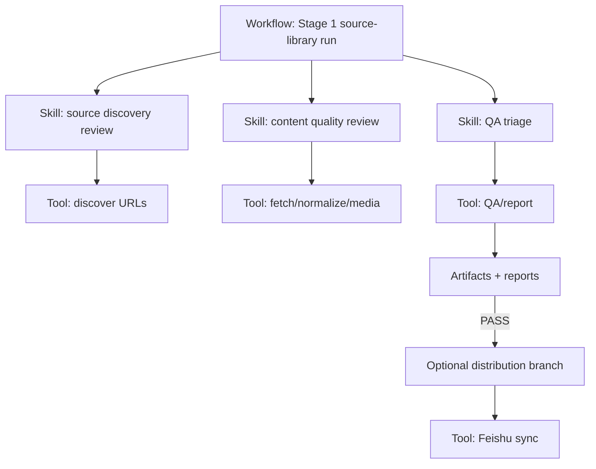
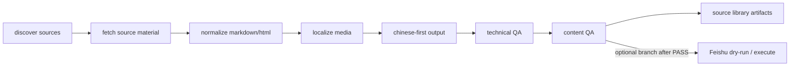
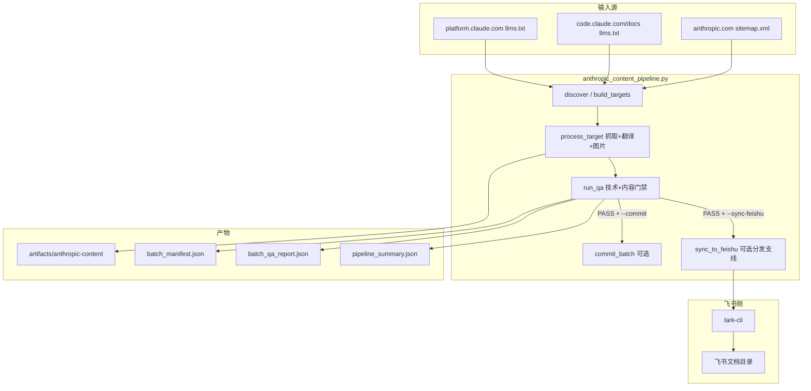

# ARCHITECTURE.md

`agent-docs` 的系统结构、阶段路线、目录规划与数据流。Agent 修改脚本、解释产物行为、调整 `docs/CODEX_GOAL.md` 入口任务时以本文为准。

## 产品定位

本仓库是**多厂商 AI/Agent 技术资料库**的基础设施。长期目标是支撑个人与团队学习 AI Coding、Agent 开发、工具使用，并为后续深度分析与商品化内容产品预留结构；当前阶段先完成高质量源材料收集与完善。

- **核心架构范式**：本仓库不是传统 hard-code 应用，而是 **Agent Skills + Workflow 驱动的知识生产系统**。Agent/Workflow 负责判断、规划、审校、阶段推进与例外处理；代码负责确定性能力，如 URL 发现、格式处理、图片本地化、接口/CLI 封装、QA、hooks、tools 与自动化测试。
- **Stage 1 主线**：开发资料源材料的高质量收集、归档、中文优先处理、结构保真、图片本地化、来源归因、技术 QA 与内容 QA。
- **Stage 1 支线**：Feishu sync 是资料收集完善后的分发支线；只有技术 PASS + 内容 PASS 后才进入 dry-run / execute，除非用户明确要求同步验收。
- **后续阶段**：跨厂商主题 taxonomy、学习路径、深度分析、课程化/商品化包装、版权与发布策略先做架构预留，不作为 Stage 1 完成条件。
- **厂商库**：`anthropic-docs/` active；`openai-docs/`、`gemini-docs/`、`cursor-docs/` reserved。
- **飞书侧根目录**：`agent-docs/`（`FEISHU_DOC_FOLDER_TOKEN` 指向该文件夹）。

`docs/CODEX_GOAL.md` 是 Codex `/goal` 从本仓库领取任务的入口提示词，不是架构文档；它应引用本文并执行本文定义的阶段边界、模块职责和验收门禁。

## 阶段路线

| 阶段 | 目标 | 当前状态 | 完成标准 |
|------|------|----------|----------|
| Stage 1 — Source Library Foundation | 高质量收集与完善官方开发资料源材料 | active | 技术 PASS + 内容 PASS；Feishu sync 可选 |
| Stage 2 — Learning Library Architecture | 建立跨厂商主题 taxonomy、学习路径、深度分析模板 | planned | 产出主题索引、学习路径、分析模板，不要求商品化 |
| Stage 3 — Productization | 将已验证资料与分析包装为可售内容产品 | TODO | 发布前完成版权、SKU、交付格式、更新承诺、商业策略 |

## 控制平面与确定性工具层

系统分为两层：

| 层 | 责任 | 形态 |
|----|------|------|
| Agent Skills + Workflow 控制平面 | 决定做什么、按什么阶段做、何时进入审校/重试/分发、如何处理例外和开放问题 | `docs/CODEX_GOAL.md` 入口、未来的 skills/workflows、人工确认点、经验沉淀 |
| Deterministic Tools 工具层 | 把明确的、可测试的动作实现稳定：抓取、解析、格式转换、图片下载、报告生成、命令封装、QA、hooks、测试 | Python/Bash scripts、CLI wrappers、JSON reports、automated tests |

架构原则：

- Agent 不应把确定性格式处理、图片下载、CLI 参数拼接等逻辑长期写在 prompt 里；这些应沉淀为 tools。
- Tools 不应承担内容判断、商业策略、学习路径设计等开放性决策；这些属于 skills/workflows。
- Workflow 是主流程，Feishu、git commit、商品化导出都是 workflow 的分支，不应反向控制 source library 主线。
- 每个阶段的完成声明必须基于 artifact/report/test，而不是 Agent 主观总结。

建议的控制流程：



### Stage 1 主线

Stage 1 的主线是 source library，而不是分发渠道：



Stage 1 不做：

- 不把原文源材料直接包装为付费商品。
- 不要求完成深度分析、课程化、SKU、定价或销售页。
- 不为了同步飞书而绕过内容完整性、来源归因、图片或结构门禁。

### 质量门禁

Stage 1 的 QA 分两层，均从第一天执行：

| 门禁 | 目标 | 代表检查 |
|------|------|----------|
| 技术 PASS | 证明资料被可靠抓取、归档、可复现 | source/final 文件存在；图片下载并本地化；标题/表格/链接/图片计数不下降；`pipeline.log` 可定位失败；`batch_qa_report.json` PASS |
| 内容 PASS | 证明资料作为学习源材料可用 | 原文来源可追溯；中文优先或翻译缺失被标记；术语保留一致；代码块/表格/图片/链接结构保真；正文非空且不是 not-found 页面 |
| 分发 PASS | 证明可选渠道可用 | Feishu dry-run 路径正确；execute 后 `feishu_sync_report.json` PASS；正文长度和图片数量验证通过 |

分发 PASS 不替代技术 PASS 或内容 PASS。

## 目标目录结构

仓库目录分为当前已实现结构和后续规划结构。新增目录前应先确认是否已进入对应阶段。

```text
agent-docs/
  AGENTS.md                         # Agent 入口与操作约束
  ARCHITECTURE.md                   # 架构、阶段路线、目录规划与数据流（本文）
  DEBUG.md                          # 排障与验证清单
  EXPERIENCE.md                     # 经验与决策沉淀
  README.md                         # 人类快速开始
  workflows/
    stage1_source_library.md        # Stage 1 控制流程（active）
  docs/
    CODEX_GOAL.md                   # Codex /goal 任务入口提示词
    FEISHU_CLI_INTEGRATION.md       # 飞书 CLI 接入说明
    superpowers/specs/              # 已批准设计规格
    taxonomy/                       # Stage 2 规划：跨厂商主题 taxonomy
    productization/                 # Stage 3 规划：发布前商业策略与版权边界
  scripts/
    anthropic_content_pipeline.py   # Stage 1 active pipeline
    setup-feishu-cli.sh
    check-feishu-cli.sh
    check-feishu-cli-auth.sh
    auth-feishu-cli.sh
  artifacts/
    anthropic-content/              # Stage 1 active source library artifacts
    openai-content/                 # reserved
    gemini-content/                 # reserved
    cursor-content/                 # reserved
```

`docs/taxonomy/` 与 `docs/productization/` 是阶段规划位置，不应在 Stage 1 为了形式化而提前填充大量空文档。

### 目标代码结构（规划）

当前主实现集中在 `scripts/anthropic_content_pipeline.py`。它适合作为 Stage 1 MVP，但长期存在定位偏窄、文件过大、封装不足的问题：抓取、格式处理、图片、翻译、QA、Feishu sync、日志、CLI、vendor registry 都耦合在同一文件中。目标不是把项目改成传统后端应用，而是把确定性能力拆成可被 Agent Skills + Workflow 调用和测试的 tools。

规划结构：

```text
agent-docs/
  workflows/
    stage1_source_library.md          # Stage 1 控制流程：发现→抓取→QA→可选分发
    stage2_learning_library.md        # Stage 2 规划：taxonomy、学习路径、分析模板
  skills/
    source-discovery/
    content-quality-gate/
    vendor-onboarding/
    qa-triage/
  agent_docs/                         # 确定性 Python 工具包（Phase B/C 逐步落地）
    core/                             # config, logging（active）
    vendors/                          # registry（active）
    ingest/                           # discovery, fetch, normalize, media, translate, process（active）
    qa/                               # technical + content gates, batch runner（active）
    sinks/                            # Feishu sync（active）
    cli/                              # Anthropic pipeline CLI（active）
  scripts/
    anthropic_content_pipeline.py     # 兼容入口 wrapper（~20 行）
  skills/
    source-discovery/SKILL.md         # active
    content-quality-gate/SKILL.md     # active
    qa-triage/SKILL.md                # active
```

迁移策略：

1. **Phase B（完成）**：`agent_docs/core`（config、logging）与 `agent_docs/vendors/registry` 已抽出；`scripts/anthropic_content_pipeline.py` 通过 import 使用，CLI 行为不变。
2. **Phase C（完成）**：`agent_docs/ingest/`（normalize、fetch、discover、media、translate、metadata、process）与 `agent_docs/qa/`（gates、runner）已抽出；HTTP/QA/翻译阈值等 magic values 收敛至 `agent_docs/core/config.py`；`batch_qa_report.json` 保留 `qa_status` 并新增 `technical_status`、`content_status`。
3. **Phase D（完成）**：`agent_docs/sinks/feishu.py` 已抽出（folder mapping、import payload、lark-cli sync、path self-test）；`scripts/anthropic_content_pipeline.py` 通过 `agent_docs.sinks` 调用，CLI 行为不变。
4. 先保持 `scripts/anthropic_content_pipeline.py` CLI 行为不变，新增 package 后由 wrapper 调用，避免破坏现有 npm scripts。
5. **Phase E（完成）**：`agent_docs/cli/anthropic.py` 承载 discover/crawl/QA/sync 编排；`scripts/anthropic_content_pipeline.py` 瘦身为兼容 wrapper；Stage 1 skills（`source-discovery`、`content-quality-gate`、`qa-triage`）落地于 `skills/`。
6. 每步迁移后运行 `python3 -m py_compile` 与 `npm run anthropic:crawl:smoke`。
7. 不在重构期引入新的商业化或学习路径逻辑；这些由 workflows/skills 规划，依赖稳定 source artifacts。

## 模块边界

Stage 1 模块按数据流单向依赖，避免 Feishu、商品化或分析逻辑反向污染源材料收集。

| 模块 | 当前位置 | 职责 | 依赖方向 |
|------|----------|------|----------|
| Vendor registry | `VENDOR_LIBRARIES` | 定义厂商状态、飞书根、artifact 根 | 被 discovery / reporting 读取 |
| Source discovery | `build_targets` | 发现官方 URL 清单 | 不依赖 fetch / sync |
| Fetch & normalize | `fetch_url`, `process_target` | 抓取源材料并生成 markdown/html 产物 | 依赖 discovery 输出 |
| Media localization | `process_target`, `images.json` | 下载图片、改写本地引用、记录状态 | 依赖 fetch 输出 |
| Translation / Chinese-first | `pick_preferred_source_url`, `translate_markdown` | 中文优先与必要翻译 | 依赖 normalized content |
| QA | `run_qa` | 技术 PASS 与内容 PASS 的机器门禁 | 依赖 artifacts，不依赖 Feishu |
| Observability | `PipelineLogger`, reports | 记录进度、错误、可重放证据 | 横切模块，不记录 secrets |
| Distribution | `agent_docs/sinks/feishu.py` (`sync_to_feishu`) | 可选 Feishu dry-run / execute | 只能依赖 QA PASS 后 artifacts |
| Learning/product layers | planned docs/modules | 主题索引、学习路径、商品化 | 后续阶段依赖 source library，不反向修改源材料 |

核心依赖规则：`source collection → QA → optional distribution → future learning/product layers`。任何新功能若要求从后续层反向改变源材料归档，应先记录架构决策。

## 跨厂商 taxonomy 预留

Stage 2 需要在厂商官网目录之外增加横向主题索引。Stage 1 只需在 metadata/report 中保留可扩展字段，不要求完成完整分类。

初始主题草案：

| 主题 | 说明 |
|------|------|
| AI Coding | Coding Agent、IDE/CLI 工作流、代码生成、调试、重构 |
| Agent Architecture | Agent loop、planning、memory、multi-agent、runtime |
| Tool Use | 函数调用、工具协议、权限、沙箱、外部系统集成 |
| MCP | MCP server/client、资源、工具、安全边界 |
| Prompt & Context Engineering | Prompt、context window、retrieval、context compression |
| Eval & QA | benchmark、eval harness、质量门禁、回归验证 |
| Safety & Security | policy、sandbox、prompt injection、data handling |
| Deployment & Ops | observability、rate limits、成本、发布与回滚 |

后续新增厂商时，应先补 vendor onboarding checklist：官方来源、URL 分类、语言策略、图片策略、目录映射、artifact root、QA 样本、更新频率。

## 总览



## 子系统

### 1. 飞书 CLI 接入层

| 组件 | 路径 | 职责 |
|------|------|------|
| 安装引导 | `scripts/setup-feishu-cli.sh` | 调用官方 install |
| 环境检查 | `scripts/check-feishu-cli.sh` | node/npm/lark-cli、仓库文件完整性 |
| 鉴权检查 | `scripts/check-feishu-cli-auth.sh` | `lark-cli auth status` |
| 登录封装 | `scripts/auth-feishu-cli.sh` | 代理绕过、device code 模式 |
| 人类文档 | `docs/FEISHU_CLI_INTEGRATION.md` | 接入步骤与权限说明 |

npm 脚本是唯一推荐入口；Agent 应优先 `npm run feishu:*` 而非直接拼裸命令。

#### 1.1 身份模型（bot / user）

| auth_level | 判定 | 能力边界 |
|------------|------|----------|
| `bot` | `auth status` 有 appId，`No user logged in` | 租户/bot API；**不足以**完成需用户态的文档同步 |
| `user` | `auth list` 有 logged-in user | 文档创建、用户 scope API；**个人账号可达成** |

`check-feishu-cli-auth.sh` 对两级均返回 exit 0，但会打印 `[INFO]` 提示是否缺 user 登录。

验证矩阵：

| 检查 | bot 足够 | user 必需 |
|------|:--------:|:---------:|
| `feishu:check` | ✓ | |
| `feishu:check:auth` | ✓ | |
| `anthropic:sync-dryrun` | ✓ | |
| `anthropic:sync`（execute） | | ✓ |
| `lark-cli doctor` token_exists | | ✓ |

### 2. Anthropic 内容流水线

**模块化实现**（自 2026-05 Phase B–E 重构后）：

| 责任 | 模块 |
|------|------|
| CLI 编排（discover/crawl/QA/sync 触发） | `agent_docs/cli/anthropic.py` |
| 来源发现 | `agent_docs/ingest/discover.py` |
| 抓取与单篇处理 | `agent_docs/ingest/fetch.py`、`agent_docs/ingest/process.py` |
| 规范化（URL、markdown、HTML、frontmatter） | `agent_docs/ingest/normalize.py` |
| 图片本地化 | `agent_docs/ingest/media.py` |
| 翻译与中文优先 URL 选择 | `agent_docs/ingest/translate.py` |
| Metadata 写入 | `agent_docs/ingest/metadata.py` |
| QA 门禁与汇总 | `agent_docs/qa/gates.py`、`agent_docs/qa/runner.py` |
| Feishu 分发 sink | `agent_docs/sinks/feishu.py` |
| 配置常量与日志 | `agent_docs/core/config.py`、`agent_docs/core/logging.py` |
| 厂商注册表 | `agent_docs/vendors/registry.py` |

`scripts/anthropic_content_pipeline.py` 现为 **~20 行兼容 wrapper**，仅承担两个职责：保留 npm scripts 入口、把 repo root 加到 sys.path（无需 `pip install` 即可运行）。**真实实现已不在此文件中**；改流水线行为时定位到对应 `agent_docs/` 模块。

#### 2.1 目标发现 `build_targets` / `discover_only`

- **Platform docs**：`https://platform.claude.com/llms.txt`
- **Code docs**：`https://code.claude.com/docs/llms.txt`
- **News/articles**：`https://www.anthropic.com/sitemap.xml`，按前缀过滤：
  - `news`, `research`, `engineering`, `learn`, `economic-futures`, `system-cards`

`--discover-only` 写出 `{output_root}/discover.json`，不抓取正文。

#### 2.2 单篇处理 `process_target`

对每条 URL：

1. 抓取 markdown/html（文档站优先 `/zh-CN/`、`/zh/`）
2. 结构化计数：表格、标题、链接、图片
3. 图片下载到 `{item_dir}/media/`，正文替换为本地 `media/` 引用
4. 翻译（若需要且无中文）：`LANGCRAFT_CMD` → OpenAI → 失败则 QA 标记
5. 写出：
   - `source.md` — 原始内容 + metadata
   - `final.zh.md` / `final.en.md` — 最终语言版本
   - `images.json` — 图片状态
   - `raw.html` — 非新闻来源 HTML 备份

#### 2.3 分批 `write_batch`

- 批目录名：`batch-001`, `batch-002`, ...
- 每批固定生成：
  - `batch_manifest.json` — 配置、items、QA、可选 feishu/git 结果
  - `batch_qa_report.json` — QA 详情（提交/同步阻断依据）

**续跑策略**：若 `output_root` 已存在 `batch-*` 且未传 `--resume-output`，流水线直接 `FAIL`（防旧产物混入）。

#### 2.4 QA `run_qa`

`qa_status`: `PASS` | `FAIL` | `SKIPPED`（`--no-qa`）

失败条件（节选）：

| 检查项 | 错误码示例 |
|--------|------------|
| 输出文件缺失 | `missing_files` |
| 正文过短 | `empty_output` |
| 表格/标题/链接数量下降 | `table_count_decrease`, `heading_count_decrease`, `link_count_decrease` |
| 图片下载失败或未本地化 | `image_download_failed`, `image_not_localized` |
| 需要翻译但无中文 | `translate_missing`, `zh_output_language_check_failed` |

中文判定：`chinese_ratio(text) >= 0.005`（CJK 字符占比）。

#### 2.5 Git 提交 `commit_batch`

- 触发：`--commit` 且（QA PASS 或 `--force-commit`）
- 动作：`git add {batch_dir}` + `git commit -m "chore: add anthropic content batch {name}"`
- QA FAIL 时写入 `git_commit: false, reason: blocked_by_qa`

#### 2.6 飞书同步 `sync_to_feishu`

- 触发：`--sync-feishu`
- 策略：`drive +import`（不用 `docs +create --content`，v2 下会产出空文档）
- 门禁：QA 必须 `PASS`，除非 `--force-sync`
- 目录：按 **来源 URL** 映射；`feishu_folder_segments` 返回相对 token 的段；`feishu_full_folder_path` 在报告中补全 `agent-docs/` 前缀

飞书目录映射（完整路径 = `agent-docs/` + 下表）：

| 来源 URL | 飞书完整路径前缀 |
|----------|-----------------|
| `platform.claude.com/docs/...` | `agent-docs/anthropic-docs/Anthropic/Developer-docs/{docs-path}` |
| `code.claude.com/docs/...` | `agent-docs/anthropic-docs/Anthropic/Developer-docs/Claude Code/{path}` |
| `anthropic.com/learn/...` | `agent-docs/anthropic-docs/Anthropic/Anthropic Academy/...` |
| `anthropic.com/engineering/...` | `agent-docs/anthropic-docs/Anthropic/Engineering/...` |
| `claude.com/blog/...` | `agent-docs/anthropic-docs/Anthropic/Claude/Blog/...` |
| `claude.com/resources/tutorials/...` | `agent-docs/anthropic-docs/Anthropic/Tutorials/...` |
| `claude.com/resources/use-cases/...` | `agent-docs/anthropic-docs/Anthropic/User Cases/...` |
| `claude.com/resources/courses/...` | **本阶段跳过**（视频为主） |

厂商注册表（`VENDOR_LIBRARIES`）：

| vendor | feishu_root | brand_root | artifact_root | status |
|--------|-------------|------------|---------------|--------|
| anthropic | anthropic-docs | Anthropic | artifacts/anthropic-content | active |
| openai | openai-docs | OpenAI | artifacts/openai-content | reserved |
| gemini | gemini-docs | Gemini | artifacts/gemini-content | reserved |
| cursor | cursor-docs | Cursor | artifacts/cursor-content | reserved |

仓库级目标结构（多厂商，本阶段先完成 `anthropic-docs`）：

```text
agent-docs/                          ← FEISHU_DOC_FOLDER_TOKEN（文件夹名必须是 agent-docs）
  anthropic-docs/                    ← 本阶段 active
    Anthropic/
      Anthropic Academy/           ← anthropic.com/learn
      Claude/Blog/                 ← claude.com/blog
      Engineering/                 ← anthropic.com/engineering
      Developer-docs/              ← platform.claude.com/docs
      Tutorials/                   ← claude.com/resources/tutorials
      User Cases/                  ← claude.com/resources/use-cases
  openai-docs/                     ← 预留
  gemini-docs/                     ← 预留
  cursor-docs/                     ← 预留
```

**`FEISHU_DOC_FOLDER_TOKEN`**：必须指向云盘中名为 `agent-docs` 的文件夹（默认 `FEISHU_DOC_ROOT_MODE=agent-docs-folder`）。勿用 `agent-docs-e2e-real` 等临时目录作生产根。`feishu_folder_segments` 返回相对 token 的路径段；`feishu_full_folder_path` 在 sync report 中补全 `agent-docs/` 前缀。

- 执行：`--execute-feishu` 需要 `lark-cli` + `FEISHU_DOC_FOLDER_TOKEN`
- 产物：`feishu_sync_commands.sh`、`.feishu_folder_cache.json`（跨 batch 复用 folder token）、`.feishu_index_cache.json`（folder_token → 目录总纲 doc_id）、`{output_root}/feishu_folder_index.json`（机器可读聚合索引）
- 单篇：`drive +import` 导入正文；图片用 `docs +media-insert` 追加
- **目录总纲**：`sync_feishu_folder_indexes` 按 `folder_token` 分组，生成 `sync_payload/index_{suffix}.md`；dry-run 写入 import/update 命令；execute 优先 `docs +update --mode overwrite`，失败则 re-import 并更新 index cache
- 同步后：`docs +fetch` 校验正文长度，避免假 PASS
- **目录索引（Phase 2）**：`sync_to_feishu` 结束时按 `folder_token` 分组，生成 `📋 目录总纲` markdown（`sync_payload/index_{token_suffix}.md`），dry-run 追加 `drive +import` 到 `feishu_sync_commands.sh`；execute 时优先 `docs +update --mode overwrite`（`.feishu_index_cache.json` 存 `folder_token → doc_id`），失败则 fallback 重新 import。机器可读聚合：`{output_root}/feishu_folder_index.json`（`folder_path → items[]`）。

状态：`SKIPPED` | `BLOCKED` | `DRY_RUN` | `PASS` | `PARTIAL` | `FAIL`

#### 2.7 汇总 `run_pipeline`

写出 `{output_root}/pipeline_summary.json`：

```json
{
  "output_root": "...",
  "target_count": 0,
  "batch_count": 0,
  "overall_status": "PASS|FAIL",
  "failed_batches": [],
  "items": []
}
```

`overall_status != PASS` 且未 `--allow-failures` 时进程 exit 1。

#### 2.8 可观测性 `pipeline.log`

- 路径：`{output_root}/pipeline.log`（JSON Lines，append-only）
- 字段：`timestamp_utc`, `level`（INFO/WARN/ERROR）, `stage`, `batch_id`, `item_index`, `item_total`, `source_url`, `error_code`, `message`, `artifact_path`
- 与 `batch_qa_report.json`、`images.json`、`feishu_sync_report.json` 互补；失败条目应含足够信息以定位并重试单篇

## 关键 CLI 参数

| 参数 | 默认 | 说明 |
|------|------|------|
| `--batch-size` | 20 | 每批条数 |
| `--max-items` | 0 | 限制条数（smoke） |
| `--output-root` | `artifacts/anthropic-content` | 产物根 |
| `--resume-output` | false | 允许写入已有 batch 目录 |
| `--translate-mode` | auto | auto \| command \| openai \| off |
| `--no-qa` | false | 跳过 QA |
| `--commit` / `--force-commit` | false | git 提交 |
| `--sync-feishu` / `--execute-feishu` | false | 飞书同步 |
| `--force-sync` | false | 绕过 QA 同步门禁 |
| `--allow-failures` | false | 失败仍 exit 0 |
| `--discover-only` | false | 仅发现 URL |

## 单篇目录结构

```
batch-001/
├── 001_{slug}/
│   ├── source.md
│   ├── final.zh.md
│   ├── final.en.md
│   ├── images.json
│   ├── raw.html          # 部分来源
│   └── media/
├── batch_manifest.json
├── batch_qa_report.json
└── feishu_sync_commands.sh
```

## 依赖与运行时

| 依赖 | 用途 |
|------|------|
| Python 3 | 流水线（stdlib only，无 requirements.txt） |
| Node.js + npm | 脚本入口、`npx @larksuite/cli` |
| `lark-cli` | 飞书鉴权与文档 API |
| 网络 | 抓取 Anthropic 站点、图片、翻译 API |

## 扩展点

改行为时优先定位：

| 需求 | 模块 / 函数 |
|------|-------------|
| 新增来源 | `agent_docs/ingest/discover.py::build_targets`、`agent_docs/core/config.py` 中 `ALLOWED_SITEMAP_PREFIXES` / `ALLOWED_DOC_HOSTS` 等 |
| 抓取逻辑 | `agent_docs/ingest/fetch.py::fetch_url`、`agent_docs/ingest/process.py::process_target` |
| 翻译 | `agent_docs/ingest/translate.py::call_translator`、CLI `--translate-mode` |
| QA 规则 | `agent_docs/qa/gates.py::run_technical_qa_item` / `run_content_qa_item`、`agent_docs/qa/runner.py::run_qa` |
| 飞书命令 | `agent_docs/sinks/feishu.py`（`sync_to_feishu`, `parse_doc_id_from_output`, `feishu_folder_segments`） |
| CLI 参数 | `agent_docs/cli/anthropic.py::parse_args` / `main` |

## Known Limitations

下列限制已被识别并由测试或文档固化。当下不修复，但所有改动需保留这一列表的诚实性：

| 限制 | 影响范围 | 计划/工单 |
|------|----------|-----------|
| `parse_frontmatter` 仅支持扁平 key:value YAML 子集（无 list / nested mapping / 多行字符串） | `extract_publication_time` 解析外部 markdown frontmatter；自写的 metadata 受控不受影响 | `tests/test_parse_frontmatter.py` 固定行为；如需提升，引入 `pyyaml` |
| `html_to_markdown` 在缺少系统 `html2text` 时回退到 regex 简单实现 | 跨机器输出不完全一致；下游 `count_*` QA 是同一份产物自比，因此差异为 0；但绝对结构保真度有限 | 引入 `markdown-it-py + beautifulsoup4` 之前禁止把 count delta 当作"和源 HTML 比对"的强信号 |
| QA `image_count_delta` / `table_count_delta` 等比较的是流水线自身两个阶段（rewrite 前后或翻译前后） | 信号偏弱；可检出"翻译丢段/丢表"，**不能**检出 HTML→MD 阶段就丢了的结构 | Stage 2 引入跨格式 source-of-truth 比对 |
| `extract_main_article_html` 用非贪婪正则匹配第一个 `<article>` | 嵌套或多 `<article>`（评论卡/推荐卡）页面可能截断主文 | 引入 `beautifulsoup4` 后切换为语义解析 |
| 无 HTTP 429 专用退避；线性 sleep | 限流时同步 sync 易堆栈失败 | `<rate_limits_and_performance>` 已记录；待加 `urllib3` 或 `httpx` |
| `feishu_folder_segments` 硬编码 vendor 分支（platform/code/anthropic.com/claude.com） | 多厂商扩展时需要修改函数本体 | Stage 2 `vendor-onboarding` skill 落地时改为数据驱动；见 `skills/vendor-onboarding/SKILL.md` |
| `PipelineLogger._sanitize` 基于高置信度模式扫描 secret，不做"长随机串"启发式 | 自定义 token 命名格式（如 `MY_CO_PREFIX_xxx`）可能漏过 | 加新模式时同步更新 `tests/test_pipeline_logger.py` |
| 无并发抓取 | 单线程吞吐受限 | 设计取舍，见 `<rate_limits_and_performance>` |

## 与 Agent 文档的关系

- 行为变更 → 更新本文 + 必要时 `DEBUG.md` / `EXPERIENCE.md`
- 用户可见命令变更 → 同步 `README.md` 与 `AGENTS.md` 速查表
