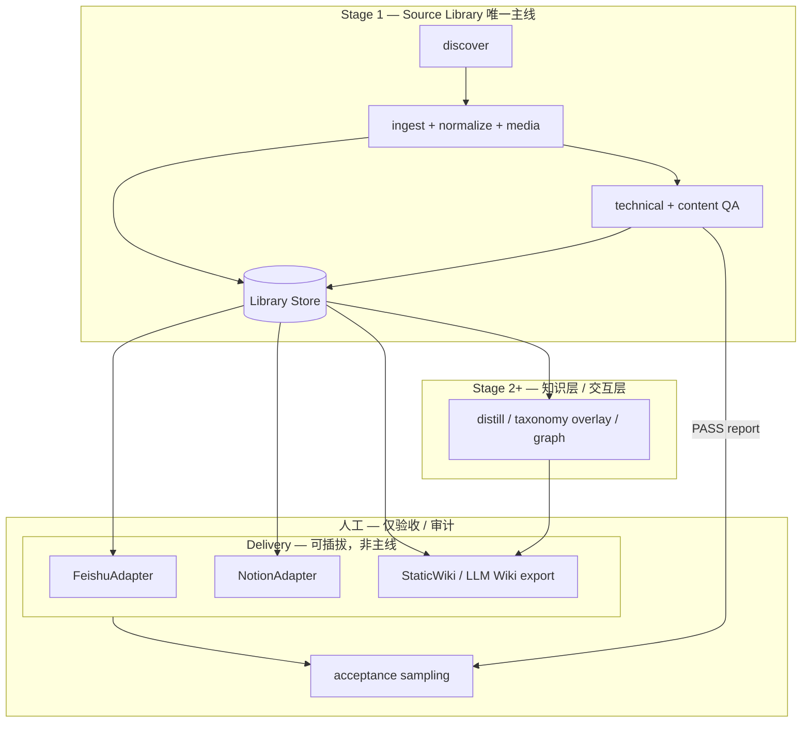

# ADR-0001: Source Library 为核，Delivery 可插拔（Feishu 非唯一终点）

- **Status**: Accepted
- **Date**: 2026-05-27
- **Deciders**: 产品/架构讨论（用户确认意图）
- **Related**: [ADR-0003](./0003-multi-vendor-taxonomy-data-driven.md), [ADR-0005](./0005-artifacts-path-mapping-analysis.md), `ARCHITECTURE.md`, `docs/superpowers/specs/2026-05-22-agent-docs-platform-design.md`

---

## Context

### 用户声明的意图

飞书云文档只是 **可能的最终交付形式之一**，还可能包括：

- Notion / 网页形态
- 按 **LLM Wiki** 思路完成提炼后交付的 **知识层 / 交互层**（在源材料之上组织与呈现，而非简单 mirror 原文）

Stage 1 的主线应是 **高质量 Source Library（源材料库）**；任何具体分发渠道或知识产品形态都是 **下游消费者**，不应反向定义采集、QA 或目录语义。

### 当前实现与文档的偏差

| 层面 | 现状 | 问题 |
|------|------|------|
| 模块命名 | `agent_docs/sinks/feishu.py` 为唯一 active sink | 心智模型变成「sinks = Feishu」 |
| Registry | `VENDOR_LIBRARIES` 含 `feishu_root`、`feishu_library_root()` | 厂商注册表与 Feishu 路径绑定 |
| 架构文档 | 「分发 PASS」、大量 Feishu 专节、mermaid 终点常是 Feishu | 读者默认 Feishu = 系统终点 |
| QA / CLI | `--sync-feishu` 嵌在 crawl 主流程编排中 | 采集与分发未解耦 |
| Taxonomy | `feishu_folder_segments(source_url)` | **分类规则 = Feishu 目录规则**，无法复用到 Notion / Wiki |

`ARCHITECTURE.md` 虽写「Feishu sync 是支线」，但代码路径、registry 字段、npm 脚本与文档篇幅仍使 Feishu 成为 ** de facto 架构中心**。这与用户声明的「架构设计未按照意图与需求实现」一致。

### 设计层应有的模型（双轨已存在，但命名错误）

当前实现已是 **本地扁平批次归档 + 飞书语义树分发** 的双轨模型（详见 [ADR-0005](./0005-artifacts-path-mapping-analysis.md)）：

- **本地**：`batch-001/{NNN_slug}/` — 优化 git diff、重跑、QA
- **飞书**：`agent-docs/anthropic-docs/Anthropic/...` — 优化人类浏览

问题在于：**Taxonomy 被实现在 Feishu adapter 内**，而非独立的、可被多种 Delivery 共用的层。

---

## Decision

### 1. 四层架构（Stage 1 及以后）

| 层 | 职责 | Stage |
|----|------|-------|
| **Library** | Canonical 源材料存储、索引、版本 | Stage 1 完成标准 |
| **Taxonomy** | `source_url → category_path`（数据驱动，按 vendor） | Stage 1 预埋，Stage 2 可 overlay 主题 |
| **Delivery** | 将 Library 条目投影到具体渠道（Feishu / Notion / Wiki 站点等） | Stage 1 可选支线 |
| **Knowledge** | 提炼、摘要、交互层（LLM Wiki 等） | Stage 2+ |

### 2. 模块与命名

- 将 `agent_docs/sinks/` 演进为 **`agent_docs/delivery/`**（或保留 `sinks` 但仅作 package 别名），Feishu 实现为 **`delivery/adapters/feishu.py`**。
- 引入 **`DeliveryAdapter` 协议**（概念接口）：输入 Library 条目 + taxonomy_path + metadata；输出 channel-specific report。
- **Registry** 字段调整（目标态）：
  - 保留 / 新增：`library_root`、`taxonomy_config`、`brand_root`
  - 移除或废弃：`feishu_root`（Feishu 专属路径移至 Feishu adapter 配置）

### 3. Stage 1 完成标准

- **Done = Library QA PASS**（`technical_status` + `content_status`），不依赖任何 Delivery。
- Delivery PASS（原「分发 PASS」）仅当用户 **显式启用某 delivery sink** 时适用，且 **不替代** 技术/内容 PASS。

### 4. CLI / npm 边界

- Crawl / QA 主命令 **不包含** sync 副作用。
- Delivery 独立入口，例如：`npm run anthropic:deliver -- --sink=feishu`（具体命名实现时定）。
- `--sync-feishu` 保留为 **兼容别名**，文档标记 deprecated，指向 delivery 子命令。

### 5. LLM Wiki / 知识层定位

- **不是** Feishu 的替代品，而是 **Library 的上层消费者**（与 Delivery 并列或在其后）。
- Stage 1 不在代码中实现知识层，但在目录与 metadata 上预留：`taxonomy_path`、跨文档 `doc_id`、可扩展 `meta.json` 字段。

---

## Consequences

### Positive

- 架构与用户意图一致：Feishu、Notion、Wiki 平级可选。
- Taxonomy 一次定义，多 channel 复用（见 ADR-0003）。
- Stage 1 验收不再被「是否同步飞书」绑架。
- 后续 LLM Wiki / 知识交互层有清晰挂载点。

### Negative / 成本

- 需迁移：`feishu_folder_segments` → taxonomy 配置 + Feishu mapping。
- 文档、AGENTS、CODEX_GOAL、skills 中大量 Feishu 叙事需分批修订。
- 短期存在兼容层（旧 CLI flag、旧 report 字段名）。

### 与现有 spec 的关系

`docs/superpowers/specs/2026-05-22-agent-docs-platform-design.md` §2.1 已写「Feishu、git commit、商品化导出均为 workflow **分支**」——本 ADR **Accepted** 后，应把 ARCHITECTURE 与 registry **实现** 拉到与该原则一致。

---

## Alternatives considered

| 方案 | 未采纳原因 |
|------|------------|
| 仅改文档，代码仍 Feishu-centric | 无法消除 taxonomy 与 Feishu 耦合，多厂商仍要改 Python |
| 本地目录 mirror 飞书 taxonomy | 与 git/重跑/QA 优化目标冲突；Library 应用稳定 `doc_id` 而非云盘树 |
| Stage 2 再做 Delivery 抽象 | 用户要求现在就按多交付形态设计，避免债滚债 |

---

## Implementation notes（非绑定，供排期）

1. ADR + ARCHITECTURE 文档对齐（本 PR 簇）。
2. Taxonomy YAML 抽离 + 单测（Feishu adapter 改为消费者）。
3. Registry 去 Feishu 化 + CLI `--vendor`。
4. Library layout（ADR-0004）+ Delivery 协议 + Feishu 迁入 adapter。
5. 默认去掉中间人工 execute 确认（ADR-0002）。
