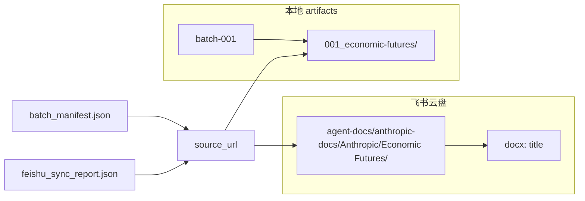

# ADR-0005: 附录——当前本地 artifacts 与飞书路径映射现状分析

- **Status**: Accepted（分析记录；部分结论已驱动 ADR-0001 / 0003 / 0004）
- **Date**: 2026-05-27
- **Type**: Analysis appendix（现状盘点 + 与预期对照）
- **Related**: [ADR-0001](./0001-source-library-and-pluggable-delivery.md), [ADR-0004](./0004-library-run-storage-model.md), `ARCHITECTURE.md`, `AGENTS.md`

---

## 1. 分析结论摘要

**整体设计恰当，且与 AGENTS.md / ARCHITECTURE.md 的主意图高度一致**：本地 artifacts 采用「批次 + URL slug 可追溯归档」，飞书云盘采用「多厂商根 + 来源 URL 语义分类」，二者通过 `source_url` / `batch_manifest.json` / `feishu_sync_report.json` 关联，**而不是目录路径一一镜像**。

**主要偏差**（文档 vs 实现 vs 预期）：

| 维度 | 结论 |
|------|------|
| 飞书多厂商根、`agent-docs/` 前缀、URL 驱动 taxonomy | **符合预期**，有单测锁定 |
| 本地 `batch-001/{NNN_slug}/` + 标准文件集 | **符合预期**，样本 artifacts 已验证 |
| 文档标题作飞书叶子节点、无 `-import` | **符合**（叶子是 **docx 文档名**，不是子文件夹） |
| 本地目录 **不** 镜像飞书 taxonomy | **有意设计**，但易被误解为「不一致」 |
| `News` / `Research` / `Economic Futures` / `System Cards` | **代码已实现**，AGENTS 树状图 **未画全** |
| `final.zh.md` **与** `final.en.md` 同时存在 | **文档过度描述**；实现只写 **一个** `final.{lang}.md` |
| `artifact_root()` 注册表 | **未接入 CLI**，默认 output 仍硬编码 |
| `--resume-output` | 仅绕过「已有 batch 则 FAIL」，**不跳过已完成的 batch**，有覆盖风险 |
| `feishu_folder_segments` | **Anthropic URL 硬编码**，多厂商需改函数本体（→ 见 ADR-0003） |

**是否恰当**：Stage 1「源材料库 + 可选飞书分发」下 **恰当**；若期望「本地目录与飞书目录同构」，当前 **不符合**（→ ADR-0004 Library 模型）。

---

## 2. 设计层：文档定义的目录模型

### 2.1 本地 artifacts（Source Library）

**仓库级**（`ARCHITECTURE.md`）：

```text
artifacts/
  anthropic-content/              # Stage 1 active
  openai-content/                 # reserved
  gemini-content/                 # reserved
  cursor-content/                 # reserved
```

**单批 + 单篇**（文档描述；实现有细微差异，见 §3）：

```text
batch-001/
├── 001_{slug}/
│   ├── source.md
│   ├── final.zh.md               # 文档曾写双文件；实现仅其一
│   ├── final.en.md
│   ├── images.json
│   ├── raw.html
│   └── media/
├── batch_manifest.json
├── batch_qa_report.json
└── feishu_sync_commands.sh
```

**output_root 级**：`discover.json`、`pipeline.log`、`pipeline_summary.json`；飞书缓存在 output_root：`.feishu_folder_cache.json`、`.feishu_index_cache.json`、`feishu_folder_index.json`。

**追溯链**：

```text
discover → build_targets → crawl → batch_manifest.json → batch_qa_report.json → (可选) feishu_sync_report.json
```

### 2.2 飞书云盘（Distribution — 当前唯一实现的 Delivery）

- `FEISHU_DOC_FOLDER_TOKEN` → 云盘文件夹名必须是 **`agent-docs`**
- `FEISHU_DOC_ROOT_MODE=agent-docs-folder`（默认）：token 已在 `agent-docs/` 内
- 报告 `folder_path` **含** `agent-docs/` 前缀；`folder_segments`（mkdir 用）**不含**该前缀

**Anthropic 子树**（来源 URL 驱动，摘自 AGENTS.md）：

```text
agent-docs/                       ← FEISHU_DOC_FOLDER_TOKEN
  anthropic-docs/
    Anthropic/
      Anthropic Academy/          ← anthropic.com/learn
      Claude/
        Blog/                       ← claude.com/blog
      Engineering/                  ← anthropic.com/engineering
      Developer-docs/               ← platform.claude.com/docs
        agents-and-tools/
          agent-skills/
            {文档标题}              ← docx 名，非 URL slug 目录
      Tutorials/                    ← claude.com/resources/tutorials
      User Cases/                   ← claude.com/resources/use-cases
  openai-docs/                      ← 预留
  gemini-docs/
  cursor-docs/
```

**叶子语义**：`{文档标题}` 是导入后的 **docx 名称**（`drive +import --name`），不是 URL 最后一段 slug 的子文件夹。

---

## 3. 实现层：代码如何生成路径

### 3.1 本地 output_root 与 batch

| 项 | 实现 |
|----|------|
| 默认 output | `artifacts/anthropic-content`（`DEFAULT_OUTPUT_ROOT`） |
| CLI | `--output-root` 可覆盖；smoke → `artifacts/anthropic-content-smoke` |
| batch 名 | `batch-{序号:03d}` |
| 防混批 | 已有 `batch-*` 且无 `--resume-output` → FAIL |

实现位置：`agent_docs/cli/anthropic.py`（`write_batch`、batch 循环、`--resume-output` 检查）。

### 3.2 单篇目录与 slug

```python
# agent_docs/ingest/process.py（概念）
slug = safe_slug(source_url)
item_dir = batch_dir / f"{index:0{ITEM_DIR_INDEX_WIDTH}d}_{slug}"
```

- `ITEM_DIR_INDEX_WIDTH = 3` → `001_` … `999_`
- slug 来自 **URL path**，不是 document title

**样本**（`artifacts/anthropic-content-smoke/batch-001/`）：

- `001_economic-futures/`
- `002_economic-futures__program/`
- `005_engineering__AI-resistant-technical-evaluations/`

### 3.3 单篇文件

| 文件 | 行为 |
|------|------|
| `source.md` | YAML frontmatter + 源 markdown |
| `final.{lang}.md` | **仅一个**，由 `final_lang` 决定（zh 或 en） |
| `images.json` | 图片 manifest |
| `raw.html` | **所有来源都写**（含 news）；ARCHITECTURE 写「部分来源」为文档偏差 |
| `media/` | 本地化图片 |

### 3.4 batch 级 manifest / QA

- `batch_manifest.json`：items、config、可选 feishu/git 结果
- `batch_qa_report.json`：`qa_status`、`technical_status`、`content_status`、`errors`

### 3.5 飞书 folder_segments（当前 Taxonomy 实现位置 — 待迁移）

**基础前缀**（`agent_docs/sinks/feishu.py` + registry）：

- `feishu_path_base(cfg, vendor)` → `[anthropic-docs, Anthropic]`（folder token 模式）

**URL → segments**（`feishu_folder_segments`）：

| 来源 | folder_segments（相对 token） |
|------|------------------------------|
| `platform.claude.com/docs/...` | `anthropic-docs/Anthropic/Developer-docs/{parent-of-leaf}` |
| `code.claude.com/docs/...` | `.../Developer-docs/Claude Code/{parent}` |
| `anthropic.com/{learn\|engineering\|news\|...}/...` | `.../{Category}/` |
| `claude.com/blog/...` | `.../Claude/Blog/` |
| `claude.com/resources/tutorials\|use-cases/...` | `.../Tutorials/` 或 `.../User Cases/` |
| `claude.com/resources/courses/...` | `[]`（跳过 sync） |

**URL 最后一段不进文件夹**（文档落在父目录）：

```python
doc_path = feishu_strip_docs_path(path_segs)
parent = doc_path[:-1] if len(doc_path) > 1 else []
return base + ["Developer-docs", *[feishu_folder_segment_name(s) for s in parent]]
```

**完整路径报告**：`feishu_full_folder_path(folder_segments, cfg)` 补全 `agent-docs/` 前缀。

**文档导入名**：`feishu_safe_name(title)` 去 `-import` 后缀，截断 80 字符。

**示例**：

- URL: `platform.claude.com/docs/en/agents-and-tools/agent-skills/best-practices`
- `folder_path`: `agent-docs/anthropic-docs/Anthropic/Developer-docs/agents-and-tools/agent-skills`
- 文档名: metadata title（如「技能编写最佳实践」）

### 3.6 feishu_sync_report.json（schema，代码定义）

由 `sync_to_feishu` 写入 `batch_dir/feishu_sync_report.json`：

```json
{
  "status": "DRY_RUN | PASS | PARTIAL | ...",
  "strategy": "drive+import",
  "feishu_doc_root_mode": "...",
  "total", "success", "fail": [],
  "items": [],
  "script": "...",
  "payload_dir": "...",
  "folder_cache", "index_cache", "feishu_folder_index",
  "folder_indexes": [],
  "media_upload_count": 0
}
```

每篇 `items[]` 含：`source_url`、`title`、`folder_segments`、`folder_path`、`folder_token`、`import_command`、`status`、`doc_id`、`doc_url`、`verification`、`media_uploads` 等。

**batch 级同步产物**：

- `feishu_sync_commands.sh`
- `sync_payload/{slug}.feishu.md`
- `sync_payload/index_{token_suffix}.md`（目录总纲）

---

## 4. 本地 vs 飞书映射关系



| 维度 | 本地 | 飞书 |
|------|------|------|
| 组织原则 | 批次 + 全局序号 + **URL slug** | **语义 taxonomy** + URL 父路径 |
| 叶子 | 目录 `001_slug/` | **docx 文档**（title 命名） |
| 多厂商 | 靠 `--output-root` | `anthropic-docs/` 等（registry + path_base） |
| 关联键 | `source_url` | 同左 |
| 路径同构 | **否** | **否** |

**差异是设计选择**（在 ADR-0001 之前合理；Taxonomy 不应绑在 Feishu 命名上）。

---

## 5. 与多厂商预留（现状）

`VENDOR_LIBRARIES` 四厂商：`anthropic` active，其余 reserved。

| 已接线 | 未接线 |
|--------|--------|
| 飞书 path 前缀 `feishu_library_root` / `feishu_brand_root` | CLI 未用 `artifact_root(vendor)` |
| artifact 目录名预留 | 无其他 vendor pipeline |
| | `feishu_folder_segments` 仅 Anthropic URL 规则 |

→ 见 [ADR-0003](./0003-multi-vendor-taxonomy-data-driven.md)。

---

## 6. 恰当之处 / 问题 / 风险

### 恰当之处

1. 职责分离：本地 = 可追溯源库；飞书 = 分发视图；QA 不依赖 Feishu。
2. 飞书映射可回归：`tests/test_feishu_folder_segments.py` + `--self-test-feishu-paths`。
3. 追溯链完整：discover → manifest → QA → sync report。
4. 防混批：默认禁止向已有 batch 根开跑。
5. courses 排除、`-import` 剥离、目录总纲等与 AGENTS 一致。

### 问题

1. 文档不一致：`final.zh/en` 双文件、README 层级、`raw.html` 范围。
2. AGENTS 树不完整：news/research/economic-futures/system-cards 在代码有、树状图无。
3. registry 与 CLI 脱节。
4. 本地 item 名 slug ≠ 飞书 title。

### 风险

1. `--resume-output` 覆盖同序号 item。
2. 多厂商扩展需改大段 Python。
3. batch 序号与 discover 顺序绑定。
4. Feishu mkdir 缓存 stale 需手动清（见 DEBUG / EXPERIENCE）。

---

## 7. 与用户预期对照（AGENTS.md）

| 预期 | 符合？ | 说明 |
|------|:------:|------|
| 多厂商根 `agent-docs/` + `anthropic-docs/` 等 | ✅ | |
| `folder_path` 含 `agent-docs/` 前缀 | ✅ | |
| `folder_segments` 不含 `agent-docs/`（folder token 模式） | ✅ | |
| 本地 `batch-001/{NNN_slug}/` + 标准文件 | ✅ | |
| `source.md`, `final.*.md`, `images.json`, `raw.html`, `media/` | ⚠️ | final 单语言；raw.html 全写 |
| 来源 URL 驱动飞书 taxonomy | ✅ | 实现在 Feishu 模块内 |
| Engineering / Blog / Developer-docs / … | ✅ | |
| 文档标题作叶子、无 `-import` | ✅ | |
| courses 不同步 | ✅ | |
| discover → manifest 追溯 | ✅ | |
| openai/gemini/cursor 预留 | ⚠️ | registry 有，无 pipeline |
| 本地目录镜像飞书 taxonomy | ❌ | 未实现；ADR-0004 不追求 mirror |
| **飞书仅为交付形式之一** | ❌（架构债） | ADR-0001 目标态 |

---

## 8. 改进建议（与 ADR 映射）

| 建议 | 对应 ADR |
|------|----------|
| 文档对齐实现（final 单文件、raw.html、sync 脚本层级） | 文档 PR |
| CLI 接 registry `library_root` | ADR-0003 |
| `--resume-output` → index 驱动续跑 | ADR-0004 |
| Taxonomy 数据化 | ADR-0003 |
| Delivery 协议，Feishu 降为 adapter | ADR-0001 |
| 可选 `feishu_mirror/` 索引视图 | ADR-0004 可选 |

---

## 9. 关键代码索引

| 路径 | 角色 |
|------|------|
| `agent_docs/cli/anthropic.py` | batch 编排、output_root、resume |
| `agent_docs/ingest/process.py` | item 目录、文件写入 |
| `agent_docs/sinks/feishu.py` | folder mapping、sync、report |
| `agent_docs/vendors/registry.py` | 厂商注册表 |
| `tests/test_feishu_folder_segments.py` | 飞书路径契约测试 |

---

**总结**：当前双轨模型在 Stage 1 下 **可用且多数符合 AGENTS 飞书规范**；架构债在于 **Taxonomy 与 Feishu 绑定**、**batch 非 library 语义**、**Delivery 非可插拔**。ADR-0001–0004 针对这三点给出目标态；本附录保留 **2026-05-27 现状快照** 供迁移前后对照。
