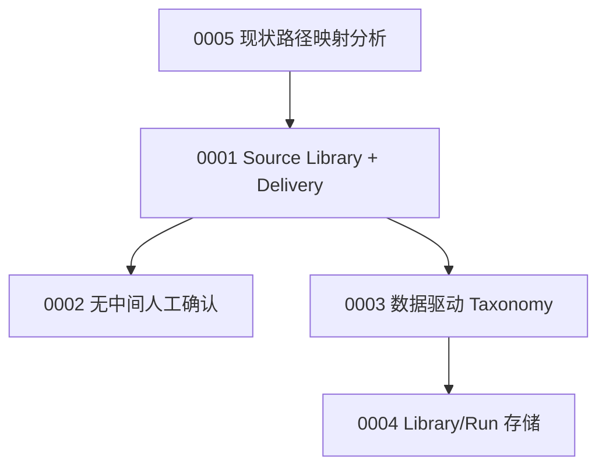

# Architecture Decision Records (ADR)

本目录存放 **架构决策记录（ADR）**：记录「为什么」做出某项设计选择，以及当时的问题背景、备选方案与后果。与 `ARCHITECTURE.md`（当前系统结构与数据流）和 `docs/superpowers/specs/`（已批准的阶段规格）互补。

## 如何使用

| 文档类型 | 路径 | 用途 |
|----------|------|------|
| ADR | `docs/adr/` | 单项或一组相关决策的 **WHY** |
| 架构现状 | `ARCHITECTURE.md` | 当前实现的 **WHAT / HOW** |
| 阶段规格 | `docs/superpowers/specs/` | Stage 边界与验收的 **Approved spec** |
| 经验沉淀 | `EXPERIENCE.md` | 踩坑与历史决策的执行细节 |

**状态流转**：`Proposed` → `Accepted`（纳入实现与 ARCHITECTURE 更新）→ `Superseded`（被新 ADR 取代，保留链接）。

## 索引

| ADR | 标题 | 状态 | 日期 |
|-----|------|------|------|
| [0001](./0001-source-library-and-pluggable-delivery.md) | Source Library 为核，Delivery 可插拔（Feishu 非唯一终点） | Accepted | 2026-05-27 |
| [0002](./0002-automated-pipeline-human-audit-only.md) | 流水线全自动门禁，人工仅终验与抽样审计 | Accepted | 2026-05-27 |
| [0003](./0003-multi-vendor-taxonomy-data-driven.md) | 多厂商从一开始：数据驱动 Taxonomy，Delivery 共用 | Accepted | 2026-05-27 |
| [0004](./0004-library-run-storage-model.md) | Library / Run 分离，替代 batch 目录作为存储语义 | Accepted | 2026-05-27 |
| [0005](./0005-artifacts-path-mapping-analysis.md) | 附录：当前本地 artifacts 与飞书路径映射现状分析 | Accepted | 2026-05-27 |

## 决策簇关系

## 建议落地顺序（来自 ADR 0001–0004 汇总）

1. 文档：ARCHITECTURE / AGENTS 与 ADR 对齐（Stage 1 Done = Library QA PASS）。
2. Taxonomy 数据化：从 `feishu_folder_segments` 抽出 vendor YAML + 单测。
3. Registry 去 Feishu 化：`library_root`、`taxonomy_config`。
4. Library layout 迁移：`library/{vendor}/{doc_id}/` + `index.json`。
5. Delivery 协议：`DeliveryAdapter`，Feishu 迁入 adapters；sync 与 crawl CLI 解耦。
6. 默认行为：去掉「dry-run 等人确认再 execute」的中间门禁。

## 编写规范

新 ADR 使用递增编号 `NNNN-short-title.md`，至少包含：

- **Status / Date / Context / Decision / Consequences**
- **Alternatives considered**（若有）
- **Related**：链接 ARCHITECTURE、spec、其他 ADR
