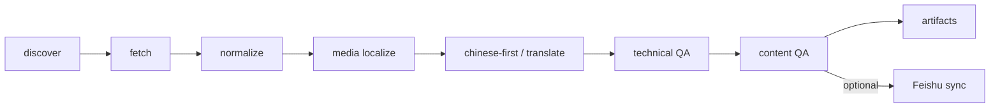
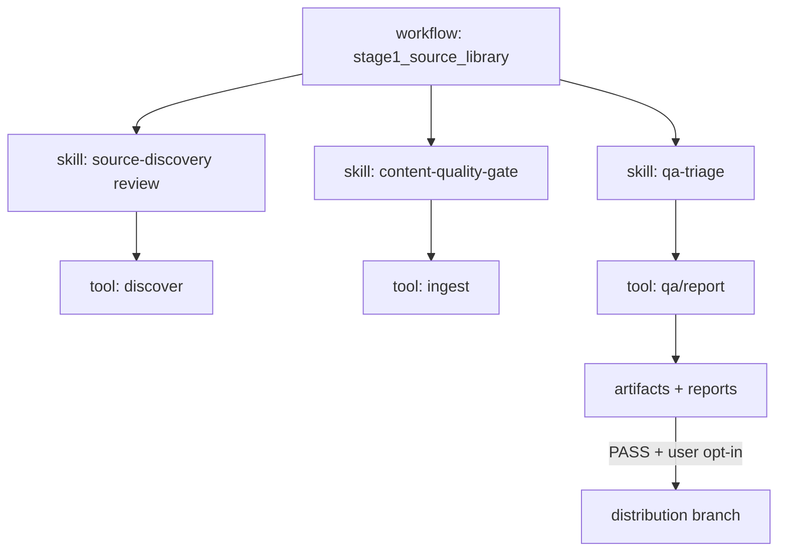

# agent-docs 平台设计规格（Stage 1 优先）

**日期**：2026-05-22  
**状态**：Approved — 2026-05-22 用户批准  
**权威架构文档**：`ARCHITECTURE.md`  
**Codex 任务入口**：`docs/CODEX_GOAL.md`（不是架构文档）

---

## 1. 问题与目标

### 1.1 问题

用户希望建设一个面向 Anthropic、OpenAI、Gemini、Cursor 等顶级 AI 厂商技术博客与开发者文档的资料库，长期服务于：

1. 个人与团队 AI Coding、Agent 开发、工具使用的权威学习资料与参考；
2. 后续深度分析与可线上销售的商品化内容。

当前仓库已有 Anthropic 抓取/QA/飞书同步 MVP（`scripts/anthropic_content_pipeline.py`），但存在：

- 架构定位偏「传统 hard-code 流水线」，未体现 **Agent Skills + Workflow** 控制平面；
- 单文件过大（~2600 行），vendor、ingest、QA、Feishu、CLI 耦合；
- `docs/CODEX_GOAL.md` 曾承担过多架构职责，与真实文档分层不符；
- Stage 1 成功标准曾偏向「同步成功」，而非「源材料收集完善」。

### 1.2 目标（分阶段）

| 阶段 | 目标 | Stage 1 是否执行 |
|------|------|:----------------:|
| Stage 1 — Source Library Foundation | 高质量收集、归档、完善开发资料源材料；技术 PASS + 内容 PASS | **是** |
| Stage 2 — Learning Library Architecture | 跨厂商 taxonomy、学习路径、深度分析模板 | 仅规划 |
| Stage 3 — Productization | SKU、版权、交付格式、商业策略 | TODO |

### 1.3 非目标（Stage 1）

- 不做商品化包装、定价、销售页。
- 不做深度分析课程化产出。
- 不为了 Feishu 同步绕过 QA 或内容完整性。
- 不一次性重构全部代码；采用渐进式拆分。

---

## 2. 架构范式（核心决策）

### 2.1 推荐方案：Skills + Workflow 控制平面 + 确定性 Tools 层

**结论**：本仓库是 **Agent Skills + Workflow 驱动的知识生产系统**，不是传统后端应用。

| 层 | 职责 | 形态 |
|----|------|------|
| **控制平面** | 阶段推进、范围判断、审校、例外处理、人工确认 | Workflows、Skills、`docs/CODEX_GOAL.md` 入口、EXPERIENCE 沉淀 |
| **工具层** | 可测试、可重放的确定性动作 | Python package、Bash CLI wrappers、JSON reports、hooks、automated tests |

**原则**：

1. 确定性逻辑（格式、图片、CLI、计数、报告）→ tools，不长期写在 prompt 里。
2. 开放性判断（是否进入分发、是否接受翻译缺失、是否扩展厂商）→ skills/workflows。
3. 完成声明必须基于 artifact/report/test，不能仅凭 Agent 自述。
4. Feishu、git commit、商品化导出均为 workflow **分支**，不反向定义 Stage 1 主线。

### 2.2 曾考虑的替代方案

| 方案 | 优点 | 缺点 | 结论 |
|------|------|------|------|
| A. 继续单文件 pipeline 扩展 | 改动少、短期快 | 不可维护、难测、与 Skills 范式冲突 | 拒绝作为长期架构 |
| B. 纯 Agent 无代码流水线 | 灵活 | 不可复现、QA 弱、成本高 | 拒绝 |
| **C. Skills/Workflow + 确定性 tools（推荐）** | 可演进、可测、符合用户思想 | 需要分阶段拆分 | **采用** |

---

## 3. 系统结构

### 3.1 Stage 1 数据流



### 3.2 控制流（Workflow 视角）



### 3.3 文档分层

| 文档 | 角色 |
|------|------|
| `ARCHITECTURE.md` | 架构、阶段、目录、模块、数据流、迁移策略 |
| `AGENTS.md` | Agent 操作约束与命令路由 |
| `docs/CODEX_GOAL.md` | Codex `/goal` **任务入口**；引用 ARCHITECTURE，不重复架构 |
| `DEBUG.md` / `EXPERIENCE.md` | 排障与决策沉淀 |
| `docs/superpowers/specs/*.md` | 经审批的设计规格（本文） |

---

## 4. 质量门禁（Stage 1 起生效）

### 4.1 技术 PASS

证明资料被可靠抓取、归档、可复现：

- `source.md` / `final.*.md` / `images.json` 存在；
- 图片下载并本地化；`image_*` 类 QA 不 FAIL；
- 标题/表格/链接/图片计数不下降；
- `pipeline.log` 可定位失败项；
- `batch_qa_report.json` → `qa_status: PASS`（技术项）。

### 4.2 内容 PASS

证明资料作为学习源材料可用（不是商品化深度包装）：

- 原文 URL、发布时间等来源归因可追溯；
- 中文优先；无中文且未翻译时明确标记（`translate_missing` 等）；
- 术语保留：Agent、Skill、Token、MCP、CLI、API 等；
- 代码块、表格、链接、图片结构保真；
- 正文非空、非 not-found 页面。

### 4.3 分发 PASS（可选支线）

- Feishu dry-run 路径正确；
- execute 后 `feishu_sync_report.json` PASS；
- 正文长度与图片数量验证通过。

**分发 PASS 不替代技术 PASS 或内容 PASS。**

---

## 5. 目录与代码结构

### 5.1 仓库目录（目标）

```text
agent-docs/
  workflows/                    # Stage 1 起逐步落地
    stage1_source_library.md
  skills/                       # Stage 1 起逐步落地
    source-discovery/
    content-quality-gate/
    qa-triage/
    vendor-onboarding/          # Stage 2 预留
  agent_docs/                   # 确定性 Python 包（自 scripts 渐进抽出）
    core/                       # config, models, logging
    vendors/                    # registry + per-vendor adapters
    ingest/                     # discover, fetch, normalize, media, translate
    qa/                         # technical, content, reports
    sinks/                      # feishu, git
    cli/                        # anthropic CLI
  scripts/
    anthropic_content_pipeline.py   # 兼容 wrapper，最终瘦身为入口
  artifacts/
    {vendor}-content/
  docs/
    CODEX_GOAL.md
    superpowers/specs/
    taxonomy/                   # Stage 2
    productization/             # Stage 3
```

### 5.2 模块边界与依赖

单向依赖：`discovery → ingest → QA → optional sinks → future learning/product layers`

| 模块 | 职责 | 禁止 |
|------|------|------|
| `vendors/registry` | 厂商状态、路径、artifact root | 不含 Feishu 执行逻辑 |
| `ingest/*` | 抓取、规范化、图片、翻译 | 不做商品化分析 |
| `qa/*` | 技术/内容门禁 | 不依赖 Feishu |
| `sinks/feishu` | 分发支线 | 不能在 QA FAIL 时默认 execute |
| workflows/skills | 阶段推进与审校 | 不替代 tools 做格式/图片处理 |

### 5.3 从 monolith 迁移（Stage 1 实施顺序）

1. **Phase A — 文档与 workflow 对齐**（低风险）  
   - 已完成：`ARCHITECTURE.md`、`AGENTS.md`、`README.md`、`CODEX_GOAL.md` 定位修正。  
   - 待做：新增 `workflows/stage1_source_library.md`；调整 `CODEX_GOAL.md` Phase 排序（QA 主线优先，Feishu 降为 optional branch）。

2. **Phase B — 抽出 core + vendors**（中风险）  
   - 抽出 `PipelineLogger`、`VENDOR_LIBRARIES`、config/models 到 `agent_docs/core` 与 `agent_docs/vendors`。  
   - `anthropic_content_pipeline.py` 改为 import wrapper。  
   - 验证：`python3 -m py_compile` + `npm run anthropic:crawl:smoke`。

3. **Phase C — 抽出 ingest + qa**（中高风险）  
   - 拆分 `build_targets`、`process_target`、`run_qa` 到 `agent_docs/ingest` 与 `agent_docs/qa`。  
   - 在 `batch_qa_report.json` 增加 `technical_status` / `content_status` 字段（向后兼容保留 `qa_status`）。

4. **Phase D — 抽出 sinks**（高风险，可选支线）  
   - `sync_to_feishu` → `agent_docs/sinks/feishu.py`。  
   - 保持 dry-run / execute 行为与 report schema 不变。

5. **Phase E — skills 落地**（控制平面）  
   - 为 source-discovery、content-quality-gate、qa-triage 编写 SKILL.md。  
   - Workflow 文档引用 tools 命令与 PASS 条件。

**不在 Stage 1 重构期引入**：taxonomy 索引、商品化模板、新厂商 pipeline。

---

## 6. Stage 1 Workflow 定义（草案）

`workflows/stage1_source_library.md` 应描述：

1. **输入**：厂商（默认 anthropic）、output_root、translate 策略。  
2. **步骤**：discover → smoke → batch crawl → technical QA → content QA →（可选）Feishu dry-run →（用户确认后）execute。  
3. **停止条件**：technical/content FAIL → qa-triage skill → 修复或跳过（需用户授权）。  
4. **完成证据**：`pipeline_summary.json` PASS + `batch_qa_report.json` PASS + 抽样人工 spot-check。  
5. **明确非步骤**：深度分析、taxonomy 标注、商品化导出。

---

## 7. Stage 2/3 架构预留（仅规划）

### 7.1 Stage 2 — Learning Library

- 横向 taxonomy：AI Coding、Agent Architecture、Tool Use、MCP、Prompt/Context Engineering、Eval、Safety、Deployment。  
- 产物：主题索引、学习路径、分析模板（非商品化成品）。  
- 依赖：Stage 1 artifacts 稳定且带来源归因。

### 7.2 Stage 3 — Productization（TODO）

- 版权与引用边界、SKU、样章、更新承诺、交付格式。  
- 发布前专项；不在 Stage 1 阻塞。

---

## 8. 测试与验证

| 层级 | 命令/检查 |
|------|-----------|
| 语法 | `python3 -m py_compile scripts/anthropic_content_pipeline.py` |
| Smoke | `npm run anthropic:crawl:smoke` |
| QA | 读 `batch_qa_report.json` |
| 内容 spot-check | 抽样 `final.zh.md` + `source.md` + 图片 |
| 分发（可选） | `npm run anthropic:sync-dryrun` → 用户确认 → sync |

改流水线后至少跑 smoke；全量前 discover → smoke → crawl。

---

## 9. 风险与缓解

| 风险 | 缓解 |
|------|------|
| 重构破坏现有 npm 脚本 | wrapper 保持 CLI 兼容；分 phase 迁移 |
| Agent 跳过 QA 声称完成 | workflow 强制 report 证据；禁止无 artifact 的 DONE |
| Feishu 再次成为隐性主线 | CODEX_GOAL 与 workflow 明确 optional branch |
| 过早商品化/分析 | Stage 边界写进 ARCHITECTURE + 本 spec |
| 单文件继续膨胀 | Phase B–D 强制拆分 |

---

## 10. 审批检查清单

审批前请确认：

- [ ] 认同 **Skills + Workflow 控制平面 + 确定性 tools** 范式  
- [ ] Stage 1 主线 = 源材料收集完善 + 技术/内容 PASS  
- [ ] Feishu sync = 可选支线  
- [ ] `CODEX_GOAL.md` = 入口，不是架构文档  
- [ ] 接受渐进式拆分 `anthropic_content_pipeline.py`  
- [ ] Stage 2/3 仅规划，不阻塞 Stage 1  

---

## 11. 审批后的下一步

1. 用户审批本 spec。  
2. 落地 `workflows/stage1_source_library.md` 与首批 skills 目录。  
3. 执行 Phase B（抽出 `agent_docs/core` + `vendors`）。  
4. 调用 writing-plans 生成详细 implementation plan。

**本 spec 未授权任何代码重构；审批前仅作设计依据。**
