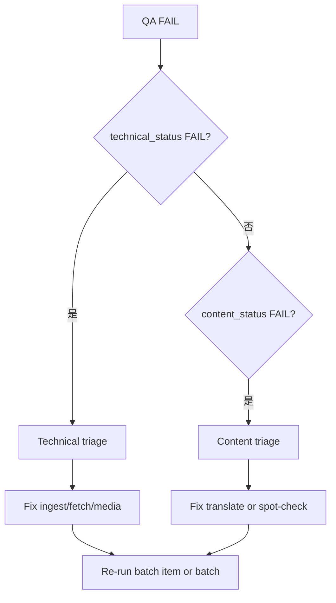

# QA Triage

Stage 1 控制平面 skill：QA **FAIL** 时的分类、根因与修复路径。

## 何时使用

- `batch_qa_report.json` → `qa_status: FAIL`
- `pipeline_summary.json` → `overall_status: FAIL`
- smoke / batch crawl 后用户要求排障

## 第一步：读证据

```bash
# 替换为实际 batch 路径
cat artifacts/anthropic-content/batch-001/batch_qa_report.json
cat artifacts/anthropic-content/pipeline.log | tail -100
```

关键字段：

| 字段 | 含义 |
|------|------|
| `qa_status` | 总门禁 |
| `technical_status` | 抓取/结构/图片等技术项 |
| `content_status` | 翻译/语言/内容项 |
| `errors` | 机器错误字符串列表 |

错误码定义见 `agent_docs/core/config.py`（`QA_ERR_*`）与 `agent_docs/qa/gates.py`。

## 分类决策树



### Technical 常见项

| 错误码 / 模式 | 可能原因 | 动作 |
|---------------|----------|------|
| `not_fetched` / `failed-fetch` | 网络、403、源站变更 | 重试；查 `pipeline.log`；更新 fetch 逻辑 |
| `empty_or_too_short_output` | 选择器失效、404 页 | 检查 `source.md`；更新 `extract_main_article_html` |
| `image_*` | 下载失败、未本地化 | 查 `images.json`；CDN/格式限制记入 `EXPERIENCE.md` |
| `*_count_decrease` | HTML→MD 丢结构 | 对比 source vs final；改 normalize |

### Content 常见项

| 错误码 | 可能原因 | 动作 |
|--------|----------|------|
| `translate_missing` | 未配置 `LANGCRAFT_CMD` / `OPENAI_API_KEY` | 配置翻译或 `--translate-mode off` 并确认策略 |
| `zh_output_language_check_failed` | 中文比例不足 | 重译或标记为 EN-only 源材料 |

## 修复后重跑

单篇验证：

```bash
python3 scripts/anthropic_content_pipeline.py \
  --max-items 1 --batch-size 1 \
  --output-root artifacts/stage1-verify \
  --target-url '<url>' \
  --translate-mode off
```

续跑 batch：

```bash
python3 scripts/anthropic_content_pipeline.py \
  --batch-size 5 \
  --output-root artifacts/anthropic-content \
  --resume-output
```

改 ingest/QA 代码后**必须**（按顺序）：

```bash
npm run lint:py
npm run test:py
npm run anthropic:crawl:smoke
npm run anthropic:verify:qa
```

检查 `artifacts/anthropic-content-verify/batch-*/batch_qa_report.json` → `qa_status: PASS`。

## 授权边界（必须遵守）

| 动作 | 需用户明确授权 |
|------|----------------|
| `--force-sync` | 是（QA 未 PASS 仍 sync） |
| `--force-commit` | 是 |
| `--allow-failures` | 是（CI/脚本 exit 0） |
| `--no-qa` | 仅 smoke；不能作为 Stage 1 完成依据 |

## 输出格式

```markdown
## QA Triage

- **Batch**: batch-NNN
- **qa_status / technical / content**: FAIL / … / …
- **Top errors**: （前 5 条，带 error_code）
- **Root cause**: 简要
- **Category**: technical | content | mixed | environment
- **Recommended fix**: 具体文件/命令
- **Re-run command**: 完整可复制命令
- **Needs user approval**: force-* / allow-failures / skip item — 是/否
```

## 边界

- **不做**：Feishu execute（属分发支线，见 workflow D 阶段）
- **不跳过** 根因分析直接 `--allow-failures`
- 新问题解法写入 `EXPERIENCE.md`；可复现步骤写入 `DEBUG.md`

## 参考

- `DEBUG.md` — QA 与验证清单
- `workflows/stage1_source_library.md` Phase 3 停止与升级
- `agent_docs/qa/runner.py`, `agent_docs/qa/gates.py`
